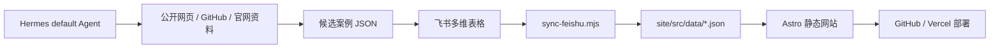

# Model Atlas 模型图谱

Model Atlas 是一个自动维护的 AI 模型资料库和真实使用案例库。

这个项目会从飞书多维表格同步模型卡数据，再用 Hermes 自动补充公开可核验的模型使用案例，最后生成一个可对外发布的静态网站。网站包含厂商页、模型详情页、案例库、模型对比页和 Coding Agent 专题页。

## 项目目标

- 系统追踪主流厂商和重点 AI 模型。
- 从飞书多维表格同步模型卡和案例记录。
- 让 Hermes 自动抓取真实使用案例，来源包括 GitHub、官网、产品页、视频、文章等公开页面。
- 对案例证据做分级，只有强证据的 A 类案例会进入对外精选展示。
- 用 Astro 生成静态网站，并通过 GitHub / Vercel 自动部署。

当前全量补齐状态：

- 活跃模型：116 个
- 达到 5 条 A 类精选案例的活跃模型：116 个
- A 类精选案例：680 条
- 总案例记录：682 条
- 活跃模型剩余目标缺口：0

## 自动化流程



完整流程是全自动的：

1. Hermes 抓取模型卡信息和真实使用案例。
2. Hermes 用配置好的飞书授权把候选案例写入飞书多维表格。
3. 网站项目从飞书同步数据到本地 JSON。
4. Astro 根据 JSON 生成静态页面。
5. GitHub / Vercel 发布最新网站。

## 目录结构

```text
.
├── site/                         # Astro 网站项目
│   ├── src/data/                 # 生成数据：模型、厂商、案例、指标
│   ├── src/pages/                # 页面路由
│   └── scripts/                  # 飞书同步、Hermes 导入、构建发布脚本
├── work/                         # Hermes 任务和补齐计划数据
├── outputs/                      # 规划文档、证据规范、自动化说明
├── design/                       # 产品和设计材料
└── vercel.json                   # Vercel 构建配置
```

## 网站页面

- `/`
- `/vendors`
- `/vendors/[vendor]`
- `/models`
- `/models/[model]`
- `/cases`
- `/compare`
- `/topics/coding-agent`

## 本地开发

```bash
cd site
npm install
npm run dev
```

本地生产构建检查：

```bash
cd site
npm run check
npm run build
npx astro preview --host 127.0.0.1 --port 4321
```

## 常用命令

构建网站：

```bash
cd site
npm run build
```

从飞书同步最新数据：

```bash
cd site
npm run sync:feishu
```

重新生成 Hermes 补齐任务：

```bash
cd site
npm run evidence:backfill
npm run hermes:tasks
```

执行同步、补齐任务生成和构建：

```bash
cd site
npm run atlas:auto
```

检查外链：

```bash
cd site
npm run check:links
```

## 关键自动化脚本

主要脚本位于 `site/scripts/`：

- `sync-feishu.mjs`：读取飞书多维表格，生成 `site/src/data/*.json`。
- `import-hermes-case-intake.py`：把 Hermes 候选案例导入飞书，并做校验和去重。
- `export-hermes-tasks.mjs`：导出 Hermes 抓取任务。
- `run_model_case_hunter_parallel.sh`：并行运行 Hermes 案例抓取任务。
- `upload_local_case_candidates_to_cloud.sh`：把本地候选案例上传到云端导入流程。
- `publish_cloud_model_data_locally.sh`：从云端拉取生成数据，本地提交并推送。
- `monitor_model_case_goal.sh`：监控全量补齐进度，完成后发送飞书通知。

## 环境变量

复制示例文件后填写真实配置：

```bash
cp site/.env.example site/.env
```

需要配置的集成包括：

- 飞书应用和多维表格凭证。
- 模型表和案例表的 table ID。
- `lark-cli` 用户授权 profile。
- Hermes 云服务器 SSH 配置。
- 可选的 Trigger.dev 定时任务配置。

不要提交任何密钥，包括飞书 app secret、SSH 密码、GitHub token、Trigger token 等。

## 证据分级规则

案例进入对外精选展示，必须满足：

- 能绑定到具体模型。
- 有明确使用者、团队、组织、产品或仓库。
- 有明确任务。
- 有公开的原始证据 URL。
- 有公开的产物 URL。
- 能说明模型在任务中的贡献。
- 能区分真实使用案例，而不是 benchmark、发布文章、教程或模型列表。

证据等级：

- `A`：公开可核验的真实使用案例，可进入精选展示。
- `B`：有价值但绑定较弱或证据不足的候选，不进入精选展示。
- `C`：背景材料。
- `D`：证据不足或不采用。

同步逻辑会尊重飞书里显式标注的非 A 等级，因此质量修正不会被自动 gate 重新提升为 A。

## 部署

项目已配置 Vercel：

```json
{
  "installCommand": "cd site && npm ci",
  "buildCommand": "cd site && npm run build",
  "outputDirectory": "site/dist"
}
```

GitHub 仓库：

```text
AL549984/model
```

数据同步完成后，生成数据会提交到 `main` 分支。Vercel 从仓库根目录读取 `vercel.json` 并构建 `site/dist`。

## 维护 Checklist

每次数据刷新发布前，建议按下面顺序检查：

1. `npm run sync:feishu`
2. `npm run evidence:backfill`
3. `npm run hermes:tasks`
4. `npm run build`
5. 确认 `site/src/data/metrics.json` 里的活跃模型缺口为 `0`。
6. 检查低置信度案例和新降级案例，避免弱证据进入对外精选。
7. 提交并推送生成数据。

快速检查覆盖率：

```bash
node - <<'NODE'
const models = require('./site/src/data/models.json');
const cases = require('./site/src/data/cases.json');
const metrics = require('./site/src/data/metrics.json');
const by = new Map();
for (const c of cases) {
  if (c.evidenceGrade === 'A' && c.showcaseEligible) {
    by.set(c.modelId, (by.get(c.modelId) || 0) + 1);
  }
}
const active = models.filter((m) => !['Archive', 'Hold'].includes(m.publishability));
const below5 = active.filter((m) => (by.get(m.id) || 0) < 5);
console.log({
  activeModels: active.length,
  verifiedACases: metrics.verifiedACases,
  activeTargetDeficit: metrics.activeCaseDeficitToTarget,
  activeBelow5: below5.length
});
NODE
```

## 注意事项

- Artificial Analysis 只作为参考信号，不能作为唯一事实来源。
- 缺失字段要明确显示为未知或官方未披露，不要编造价格、上下文长度、发布日期或性能结论。
- `Archive` / `Hold` 状态模型不计入活跃模型全量补齐目标。
- 云端 Hermes 用于后续增量更新；本地 Hermes 可用于一次性全量补齐或质量修复。
