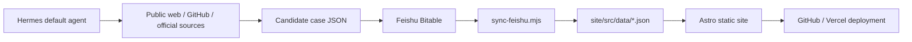

# Model Atlas

Model Atlas is an automatically maintained AI model directory and real-world case library.

The project collects model-card information from Feishu Bitable, enriches it with Hermes-gathered evidence, and builds a public static website with vendor pages, model pages, comparison views, and verified usage cases.

## What It Does

- Tracks frontier and notable AI models across major vendors.
- Syncs model cards and case records from Feishu Bitable.
- Uses Hermes agents to gather public real-use cases from GitHub, official pages, product pages, videos, articles, and other web sources.
- Grades evidence so only strongly verifiable A-grade cases are shown as public showcase cases.
- Generates a static Astro site that can be deployed through Vercel.

Current full-coverage status:

- Active models: 116
- Active models with at least 5 A-grade showcase cases: 116
- A-grade showcase cases: 680
- Total case records: 682
- Remaining active target deficit: 0

## Architecture



The intended operating model is fully automatic:

1. Hermes gathers model-card and case evidence.
2. Hermes writes approved candidate records into Feishu using the configured user/app authorization.
3. The site syncs Feishu data into JSON.
4. The build generates static pages.
5. GitHub/Vercel publish the latest website.

## Repository Layout

```text
.
├── site/                         # Astro website
│   ├── src/data/                 # Generated data: models, vendors, cases, metrics
│   ├── src/pages/                # Static routes
│   └── scripts/                  # Feishu sync, Hermes import, build/publish automation
├── work/                         # Generated task/backfill files for Hermes
├── outputs/                      # Planning docs, evidence policy, automation notes
├── design/                       # Product/design source material
└── vercel.json                   # Vercel build settings
```

## Main Routes

- `/`
- `/vendors`
- `/vendors/[vendor]`
- `/models`
- `/models/[model]`
- `/cases`
- `/compare`
- `/topics/coding-agent`

## Local Development

```bash
cd site
npm install
npm run dev
```

For a production-style local check:

```bash
cd site
npm run check
npm run build
npx astro preview --host 127.0.0.1 --port 4321
```

## Useful Commands

Run the full local site build:

```bash
cd site
npm run build
```

Sync latest Feishu data into local JSON:

```bash
cd site
npm run sync:feishu
```

Regenerate evidence backfill tasks:

```bash
cd site
npm run evidence:backfill
npm run hermes:tasks
```

Run the combined sync/backfill/build flow:

```bash
cd site
npm run atlas:auto
```

Check external links:

```bash
cd site
npm run check:links
```

## Automation Scripts

Important scripts live in `site/scripts/`:

- `sync-feishu.mjs`: reads Feishu Bitable records and writes `site/src/data/*.json`.
- `import-hermes-case-intake.py`: imports Hermes candidate cases into Feishu with validation and dedupe.
- `export-hermes-tasks.mjs`: exports crawl/backfill tasks for Hermes.
- `run_model_case_hunter_parallel.sh`: runs parallel Hermes case-hunter shards.
- `upload_local_case_candidates_to_cloud.sh`: uploads local Hermes candidates to the cloud importer.
- `publish_cloud_model_data_locally.sh`: pulls cloud-generated data locally, commits, and pushes.
- `monitor_model_case_goal.sh`: monitors full-coverage progress and sends Feishu completion notification.

## Environment

Copy the example file and fill in real values:

```bash
cp site/.env.example site/.env
```

Required integrations include:

- Feishu app / Bitable credentials
- Feishu table IDs for models and cases
- `lark-cli` profile for user-mode Feishu access
- Hermes cloud SSH configuration
- Optional Trigger.dev credentials for scheduled jobs

Do not commit secrets such as Feishu app secrets, SSH passwords, GitHub tokens, or Trigger tokens.

## Evidence Quality Rules

A case is eligible for public showcase only when it has:

- A concrete model binding.
- A real user, team, organization, product, or repository.
- A concrete task.
- A public original evidence URL.
- A public artifact URL.
- A clear model contribution.
- Enough context to distinguish real usage from a benchmark, launch post, tutorial, or model list.

Evidence grades:

- `A`: public, verifiable real-use case; eligible for showcase.
- `B`: useful candidate or weakly bound evidence; not shown as showcase.
- `C`: background material.
- `D`: rejected or insufficient evidence.

The sync gate respects explicit non-A grades from Feishu, so quality corrections are not automatically promoted back into A-grade showcase data.

## Deployment

The repo is configured for Vercel:

```json
{
  "installCommand": "cd site && npm ci",
  "buildCommand": "cd site && npm run build",
  "outputDirectory": "site/dist"
}
```

GitHub repository:

```text
AL549984/model
```

After data sync, changes are committed and pushed to `main`; Vercel can build from the repo root using `vercel.json`.

## Maintenance Checklist

Before considering a data refresh publishable:

1. `npm run sync:feishu`
2. `npm run evidence:backfill`
3. `npm run hermes:tasks`
4. `npm run build`
5. Confirm `site/src/data/metrics.json` has active deficits at `0`.
6. Review low-confidence or newly demoted cases before showcasing them.
7. Push the resulting data commit.

Quick coverage check:

```bash
node - <<'NODE'
const models = require('./site/src/data/models.json');
const cases = require('./site/src/data/cases.json');
const metrics = require('./site/src/data/metrics.json');
const by = new Map();
for (const c of cases) {
  if (c.evidenceGrade === 'A' && c.showcaseEligible) {
    by.set(c.modelId, (by.get(c.modelId) || 0) + 1);
  }
}
const active = models.filter((m) => !['Archive', 'Hold'].includes(m.publishability));
const below5 = active.filter((m) => (by.get(m.id) || 0) < 5);
console.log({
  activeModels: active.length,
  verifiedACases: metrics.verifiedACases,
  activeTargetDeficit: metrics.activeCaseDeficitToTarget,
  activeBelow5: below5.length
});
NODE
```

## Notes

- Artificial Analysis is treated as a reference source, not the sole source of truth.
- Missing fields should remain explicit as unknown or undisclosed; do not invent pricing, context window, release data, or performance claims.
- Archive/Hold models are excluded from the active full-coverage completion target.
- The cloud Hermes workflow is used for ongoing incremental updates; local Hermes can be used for one-off full backfill or quality repair.
