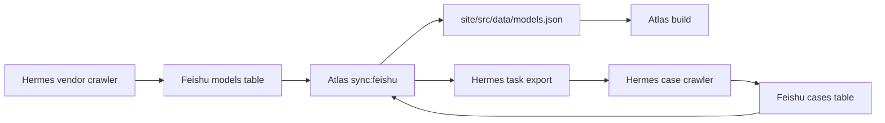

# Hermes Feishu Automation

> Goal: Hermes crawls model facts and public cases, writes Feishu Bitable, and the Atlas site syncs Feishu automatically without human review.

## End-to-End Flow



## Design Principles Learned From The Tencent Research Project

These principles are the target shape for Atlas automation. They come from the working `AL549984/news` project and should guide future Hermes work.

1. Hermes is the cloud execution owner. The website project should not own heavy crawling, login sessions, anti-bot handling, media fetching or platform-specific retry logic.
2. Feishu is the intermediate source of truth. Hermes writes model cards and case candidates to Feishu first; the website reads structured Feishu data instead of scraping Hermes outputs directly.
3. Durable state is required. Each Hermes crawler should maintain a `state.json` or equivalent database for dedupe, incremental sync, retries, source health and failure recovery.
4. The website only consumes stable exported data. Atlas should build from normalized `models`, `cases`, `vendors`, `metrics` and backfill JSON, not from raw crawler pages.
5. GitHub push triggers deployment. Hermes or the sync host should commit changed generated data to the GitHub repo connected to Vercel; Vercel remains the deployment layer.
6. Every scheduled pipeline must use locks. Full sync, near-real-time polling and deploy steps need separate locks so duplicate runs cannot overwrite each other.
7. Schedulers trigger pipelines; they do not contain business logic. Trigger.dev, cron or Hermes jobs should call shell/Python/Node pipeline scripts, while extraction, evidence grading and publishing rules live in versioned code.

## Atlas Automation Boundary

Atlas should keep these responsibilities separated:

| Layer | Owns | Must not own |
|---|---|---|
| Hermes | crawling, source adapters, Feishu writes, raw candidate discovery, durable crawler state | website rendering decisions |
| Feishu | editable model-card facts, candidate evidence tables, sync checkpoint visibility | static-site layout logic |
| Atlas repo | normalization, automatic evidence gate, JSON export, static build | platform crawling sessions |
| GitHub / Vercel | versioned generated output and deployment | evidence classification |

This lets the flow be fully automatic without making the static site brittle.

## Feishu Tables

Use Bitable as the source of truth. Free-form Feishu Docs can still hold narrative model cards, but the website sync should read structured Bitable fields.

### `models`

Required fields:

| Field | Meaning |
|---|---|
| `id` | Stable model slug used by the website |
| `name` | Display model name |
| `vendor_id` | Stable vendor id |
| `vendor` | Display vendor name |
| `publishability` | Optional; sync script recalculates non-Archive rows from A cases |
| `release_date` | Release date or explicit missing text |
| `api_model_id` | API/model id |
| `context` | Context window |
| `output` | Output limit |
| `modality` | Text / image / audio / video capability |
| `reasoning` | Reasoning / thinking signal |
| `price` | Price or missing text |
| `platforms` | Semicolon-separated platforms |
| `official_link` | Primary official URL |
| `source_links` | Semicolon-separated source URLs |
| `summary` | Model-card summary |
| `fit` | Semicolon-separated fit notes |
| `avoid` | Semicolon-separated avoid notes |
| `risk_notes` | Semicolon-separated risk notes |

### `cases`

Hermes writes every candidate here. The website script applies the automatic evidence gate and overwrites `evidence_grade`, `showcase_eligible`, `selected_for_model_card`, and `review_status`.

Required fields for automatic A:

| Field | Meaning |
|---|---|
| `case_id` | Stable case id |
| `case_title` | Case title |
| `model_id` | Must map to a model row |
| `model_name` | Display model name |
| `vendor_id` | Stable vendor id |
| `vendor` | Display vendor name |
| `user_or_org` | Specific person, team or organization |
| `original_evidence_url` | Original post/page/repo/video URL |
| `artifact_url` | Public artifact, product, repo, demo, PR, video or article URL |
| `source_platform` | GitHub, X, WeChat, Xiaohongshu, Bilibili, Douyin, official site, etc. |
| `source_type` | Must be `real_case` for A |
| `task_category` | Case category |
| `task_description` | Specific task |
| `output_result` | Concrete output or artifact |
| `model_contribution` | Why this model is bound to the artifact |
| `risk_notes` | Limitations and volatility |
| `collected_at` | Crawl date |

## Automatic Evidence Gate

The sync script promotes a case to A only when all are true:

1. `source_type` is `real_case`.
2. `model_id` maps to a known model.
3. `user_or_org` is present.
4. `task_description` is present.
5. `output_result` is present.
6. `model_contribution` is present.
7. `original_evidence_url` is an HTTP(S) URL.
8. `artifact_url` is an HTTP(S) URL.
9. The source is not collection-only, benchmark-only, tutorial-only, overview-only or search-summary-only.

Gate outputs:

| Result | Website behavior |
|---|---|
| A / `auto_approved` | Enters cases and can make model `Publishable` |
| B / `auto_candidate` | Kept as candidate, not featured |
| C / `auto_background` | Background only |
| D / `auto_rejected` | Rejected but retained in Feishu if Hermes keeps it |

## Environment Variables

Set these on the server that runs the Atlas project:

```bash
export FEISHU_APP_ID="cli_xxx"
export FEISHU_APP_SECRET="xxx"
export FEISHU_BITABLE_APP_TOKEN="bascnxxx"
export FEISHU_MODELS_TABLE_ID="tblxxx"
export FEISHU_CASES_TABLE_ID="tblxxx"
```

Optional:

```bash
export FEISHU_BASE_URL="https://open.feishu.cn"
```

## Commands

From `site/`:

```bash
npm run sync:feishu
npm run evidence:backfill
npm run hermes:tasks
npm run build
```

One-shot pipeline:

```bash
npm run atlas:auto
```

## Trigger.dev Remote Orchestration

The previous Tencent Research project uses this production pattern:

1. Trigger.dev runs a scheduled Node task.
2. The task SSHes into the Hermes server.
3. Hermes runs a locked shell pipeline under `/home/ubuntu/.hermes/profiles/news`.
4. Hermes exports site data and pushes changed files to GitHub.
5. Vercel redeploys from GitHub.

Atlas now has the same Trigger skeleton:

```text
site/trigger.config.ts
site/trigger/model-atlas.ts
site/.env.example
```

Install/deploy Trigger from `site/`:

```bash
npm run trigger:deploy
```

Required Trigger secrets:

```bash
TRIGGER_PROJECT_REF=proj_xxx
TRIGGER_SECRET_KEY=tr_prod_xxx
MODEL_ATLAS_HERMES_SSH_HOST=124.221.3.41
MODEL_ATLAS_HERMES_SSH_USER=ubuntu
MODEL_ATLAS_HERMES_SSH_PASSWORD=...
```

Optional command overrides:

```bash
MODEL_ATLAS_REMOTE_COMMAND=cd /home/ubuntu/.hermes/data/model_atlas_repo/site && bash scripts/model_atlas_auto_pipeline.sh
MODEL_ATLAS_REMOTE_POLL_COMMAND=cd /home/ubuntu/.hermes/data/model_atlas_repo/site && bash scripts/model_atlas_case_poll_once.sh
```

## Expected Hermes Server Layout

Use the existing root-level Hermes `default` gateway workspace. On the current server this is `/home/ubuntu/.hermes`, not `/home/ubuntu/.hermes/profiles/default`.

```text
/home/ubuntu/.hermes/
  config.yaml
  cron/jobs.json
  scripts/vendor_model_update_precheck.py
  data/model_atlas_repo/
    site/scripts/model_atlas_auto_pipeline.sh
    site/scripts/model_atlas_case_poll_once.sh
    site/scripts/push_model_atlas_site_to_github.py
  data/model_atlas_logs/
  data/model_atlas_locks/
  secrets/github_model_atlas_repo_token
```

The existing default Agent already has model-card automation context:

```text
/home/ubuntu/.hermes/cron/jobs.json
  frontier_model_weekly_scan
  每日12点抓取厂商更新模型并制作模型卡
/home/ubuntu/.hermes/scripts/vendor_model_update_precheck.py
```

Atlas should reuse that Agent context and place the website repo under:

```text
/home/ubuntu/.hermes/data/model_atlas_repo/
```

Do not place this under the `news` profile; `news` remains the Tencent Research production flow.

`model_atlas_auto_pipeline.sh` should:

1. Acquire a lock.
2. Run Hermes vendor/model-card crawlers.
3. Write models/cases candidate rows to Feishu Bitable.
4. Run the website pipeline:

```bash
cd /home/ubuntu/.hermes/data/model_atlas_repo/site
bash scripts/model_atlas_auto_pipeline.sh
```

5. Commit/push changed website files to the GitHub repo connected to Vercel through `push_model_atlas_site_to_github.py`.

`model_atlas_case_poll_once.sh` should:

1. Read `work/hermes-model-case-tasks.json` or the equivalent task payload.
2. Crawl case candidates across official web, GitHub, X, WeChat, Bilibili, Xiaohongshu and Douyin.
3. Write raw candidate rows to the Feishu `cases` table.
4. Run `npm run sync:feishu && npm run build`.

Keep the old `news` profile as a reference implementation. Its useful patterns are shell-level `flock`, near-real-time watcher locks, durable `state.json`, GitHub token files under `secrets/`, and no secret values committed to GitHub.

Local validation without Feishu credentials:

```bash
npm run sync:feishu:dry-run
npm run hermes:tasks
npm run check
npm run build
```

## Hermes Contract

`npm run hermes:tasks` writes:

```text
../work/hermes-model-case-tasks.json
```

Hermes should read this file or an equivalent API payload, crawl the listed sources, then write candidate rows back into the Feishu `cases` table. The Atlas sync script owns the final automatic A/B/C/D decision, so Hermes can be aggressive about discovery without directly publishing weak evidence.

## Suggested Cron

```cron
15 */6 * * * cd /home/ubuntu/.hermes/data/model_atlas_repo/site && npm run atlas:pipeline >> ../work/atlas-auto.log 2>&1
```

If deployment is separate, append the deploy command after `npm run build`.
